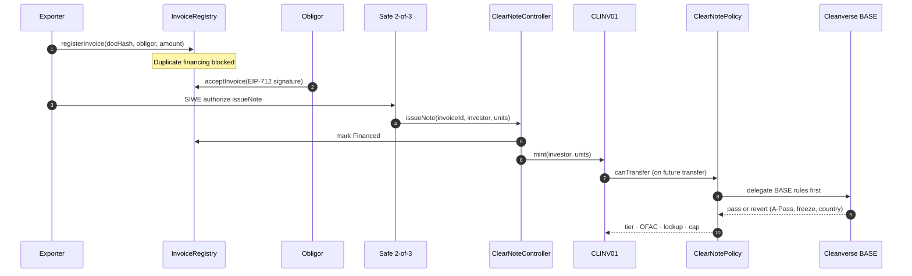
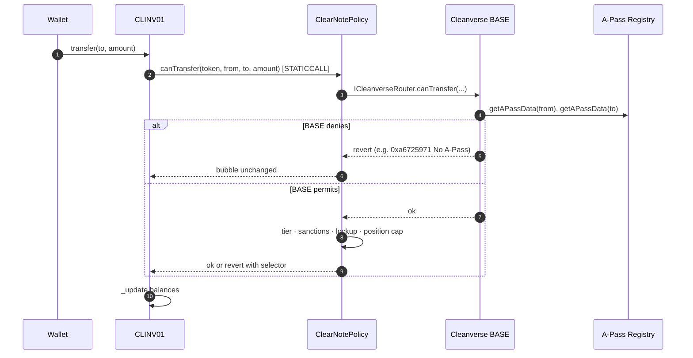

<div align="center">

# ClearNote

**Turn verified invoices into liquid, compliance-gated trade-finance notes — on Monad.**

[-6E54FF?style=flat-square)](https://testnet.monadscan.com)
[](https://docs.cleanverse.com)
[](contracts/)
[-000?style=flat-square)](contracts/test/)
[](app/)

[Live demo](#quick-start) · [Architecture](#architecture) · [Cleanverse integration](#cleanverse-integration) · [On-chain proofs](#on-chain-proofs) · [Docs](docs/)

</div>

---

## The problem

Cross-border invoice financing is slow, opaque, and easy to double-fund. Exporters wait weeks for liquidity; investors cannot verify that a note maps to a real obligation; compliance rules (identity, sanctions, transfer restrictions) are bolted on after issuance instead of embedded in the asset.

**ClearNote** closes that gap: PINT-SG invoices become **CLINV01** — a Cleanverse A-Token with programmable compliance from day one — backed by an on-chain registry, settled in **CVA aUSDC**, and traded atomically on a permissioned secondary market.

---

## What ClearNote does

| Actor | Capability |
|-------|------------|
| **Exporter / originator** | Register PINT-SG invoices, hand off to obligor, finance via Safe-gated `issueNote` |
| **Obligor** | EIP-712 acceptance — cryptographically binds payment obligation before financing |
| **Investor** | Buy notes via DvP (note leg + aUSDC cash leg), pre-flight `inspect()` before every transfer |
| **Compliance / regulator** | 13 live reason codes, OFAC merkle proofs, audit-pack hashes anchored on-chain |

Every transfer of the product token passes **Cleanverse BASE** rules first (A-Pass, freeze, country, expiry), then **ClearNotePolicy v3.2** (tier, OFAC, lockup, position cap). Denied transfers revert with machine-readable selectors surfaced in the compliance matrix.

---

## Architecture

```mermaid
graph TB
    subgraph Users["👤 Users"]
        EXP[Exporter / Originator]
        OBL[Obligor]
        INV[Investor]
        REG[Compliance / Regulator]
    end

    subgraph App["🖥️ ClearNote App · Next.js 16"]
        UI[Product UI<br/>exporter · investor · obligor]
        API[API Routes<br/>SIWE · Safe · Cleanverse proxy]
        INSPECT[Pre-flight inspect()<br/>reason-code matrix]
    end

    subgraph OffChain["📦 Off-chain services"]
        ENVIO[(Envio Indexer<br/>GraphQL :8082)]
        CVAPI[Cleanverse API v5.6<br/>CVI · CVA · CCP]
        PACK[Audit packs · PINT-SG · IVMS101<br/>hashes only on-chain]
    end

    subgraph OnChain["⛓️ Monad Testnet · chainId 10143"]
        REGISTRY[InvoiceRegistry<br/>lifecycle SSOT]
        CTRL[ClearNoteController<br/>mint / burn / lockup]
        DVP[DvPEscrow<br/>atomic note + aUSDC]
        SANCT[SanctionsRegistry<br/>OFAC merkle]
        ANCHOR[AuditAnchor<br/>pack hash only]
        SAFE[Gnosis Safe 2-of-3<br/>privileged ops]

        subgraph Tokens["A-Tokens"]
            CLINV[CLINV01 · product]
            CLNOTE[CLNOTE02 · history only]
        end

        subgraph Cleanverse["Cleanverse on-chain"]
            BASE[BASE Router<br/>canTransfer STATICCALL]
            APASS[A-Pass Registry]
            POOL[Compliance Pool<br/>CCP validator]
            AUSDC[aUSDC · CVA cash leg]
        end

        POLICY[ClearNotePolicy v3.2<br/>decorator on BASE]
    end

    EXP --> UI
    OBL --> UI
    INV --> UI
    REG --> INSPECT

    UI --> API
    API --> CVAPI
    API --> SAFE
    UI --> ENVIO
    ENVIO -.->|indexed events| REGISTRY
    ENVIO -.->|Transfer logs| CLINV

    SAFE -->|issueNote · settle| CTRL
    CTRL --> REGISTRY
    CTRL -->|mint| CLINV
    CLINV -->|setPolicy| POLICY
    POLICY -->|line 1: delegate| BASE
    BASE --> APASS
    POLICY --> SANCT

    INV -->|fill offer| DVP
    DVP --> CLINV
    DVP --> AUSDC

    API -->|validator/verify| POOL
    PACK --> ANCHOR
    SANCT --> POLICY
```

### Invoice finance flow



### Compliant transfer (every CLINV01 move)



---

## Cleanverse integration

ClearNote is built on [Cleanverse](https://cleanverse.com) primitives end-to-end — CVI, CVA, and CCP as the compliance substrate the product token inherits.

### CVI — Cleanverse Verified Identity

| Integration | Where | What it does |
|-------------|-------|--------------|
| **A-Pass on-chain** | BASE router `0x3648…12dd` | Every CLINV01 transfer checks wallet identity credentials (tier, freeze, country, expiry) via STATICCALL |
| **`query_apass` / `verify_apass`** | `app/api/cleanverse/apass`, `verify` | Off-chain CVI lookup against sandbox API; `atoken` = CLINV01 contract address |
| **`generate_apass`** | `app/api/cleanverse/generate-apass` | AES-encrypted onboarding path (API key never sent in headers) |
| **Fail-closed tier gate** | `ClearNotePolicy.sol` | If A-Pass registry is configured and lookup fails → revert `0xba7cb6e7` (not silent allow) |
| **Live probe** | `pnpm cleanverse:doctor` | 9 sandbox health checks including A-Pass query + verify |

Wallet **B** (`0x9AE53…C2b`) holds A-Pass **1104** on testnet — used in live transfer and `inspect()` proofs.

### CVA — Cleanverse Verified Assets

| Integration | Where | What it does |
|-------------|-------|--------------|
| **CLINV01 A-Token** | `0xEae6…Fe69` | Product note token launched via Cleanverse `atoken/launch`; `setPolicy` → ClearNotePolicy v3.2 |
| **aUSDC cash leg** | `0xaC08…f20D` | CVA settlement token for atomic DvP |
| **`query_deposit_atoken_list`** | `app/api/cleanverse/deposit-atokens` | Origin USDC ↔ aUSDC pair discovery per chain |
| **DvP settlement** | `DvPEscrow.sol` | Two live aUSDC fills on testnet (`e2e.dvpFillAusdc_offer0/1`) |
| **Ramp quote** | `app/api/cleanverse/ramp/quote` | Fiat on/off-ramp quote path for institutional pilots |

### CCP — Cleanverse Compliance Program

| Integration | Where | What it does |
|-------------|-------|--------------|
| **Validator contract** | `0xaC7e…1792` (Monad UAT) | CCP pre-transaction rule engine |
| **Compliance pool** | `CleanverseCompliancePool` `0x8eC6…7748` | Registered via `/validator/register`; `validator/verify` returns `valid=true` for wallet B |
| **`inspect()` matrix** | `/compliance/matrix` | Live UI mapping 13 selectors → human labels (Cleanverse + ClearNote) |
| **OFAC merkle** | `SanctionsRegistry` + Safe `commitRoot` | On-chain sanctions proofs with live verification UI |

> **Design principle:** Cleanverse enforces identity and BASE transfer rules on-chain. ClearNote adds **issuer policy** (tier floor, OFAC, lockup, position cap) as a **decorator** — BASE reverts bubble unchanged; our rules only run after BASE passes.

Full API notes: [`docs/CLEANVERSE_API.md`](docs/CLEANVERSE_API.md)

---

## On-chain proofs

All transactions on **Monad testnet (10143)**. Explorer: [testnet.monadscan.com](https://testnet.monadscan.com)

Canonical evidence JSON: [`deployments/monad-10143.json`](deployments/monad-10143.json)

| Proof | Tx / result |
|-------|-------------|
| CLINV01 `setPolicy` v3.2 | [`0x022c614a…5740c`](https://testnet.monadscan.com/tx/0x022c614a90a417453fd7ce75367eaafc51e54c4f7a7a8821d3e2030ed825740c) |
| Compliant transfer B→B2 (v3.2) | [`0x169d0453…a49d`](https://testnet.monadscan.com/tx/0x169d04538a5d05f07ee4590ca57413bd75f0d3ef96c56336f781c82115dea49d) |
| `inspect()` permits B→B2 | `ok:true code:0x00000000` (recorded in deployments JSON) |
| `issueNote` on live controller | [`0xd9a286f0…8f3d`](https://testnet.monadscan.com/tx/0xd9a286f0e897209bbf83e3b2f2c8574198f0f243fb6a325ebed3da20d3b88f3d) |
| DvP fill #0 (aUSDC) | [`0x087c6711…eec7`](https://testnet.monadscan.com/tx/0x087c67116df60a51dda6c5391a2cb781a35da669e82ff754cadd766f8c6ceec7) |
| DvP fill #1 (aUSDC) | [`0xa7747e95…caae`](https://testnet.monadscan.com/tx/0xa7747e952836e7caa09df11f33b70e5b608d04e0224fcef07768dc30673fcaae) |
| OFAC root committed (Safe) | [`0x50cc6836…34ba0`](https://testnet.monadscan.com/tx/0x50cc683608f507db8bdcc4045267ba932460517d2b165692a08d677e45434ba0) |
| Audit pack anchored (INV-001) | [`0x36d69a93…59fb`](https://testnet.monadscan.com/tx/0x36d69a93f0e5c24e3674db01e9405f89c17b0924f8b77fc61c790bfaef7359fb) |
| CCP pool registered | [`0x0922080d…cdfc`](https://testnet.monadscan.com/tx/0x0922080da02b6eafbb058168e96a9c5f2d91adb81307cf64d1fcab48c656cdfc) |

Reproduce everything locally:

```bash
pnpm verify:wo08          # live inspect() + CLINV01 wiring
pnpm seed:verify          # 23 manifest invoices / 11 financed on-chain
pnpm cleanverse:doctor    # 9 Cleanverse sandbox probes
node scripts/verify-cva-integration.mjs   # CVA + DvP + validator pool
forge test                # 48 Foundry tests
```

---

## Deployed contracts

| Contract | Address |
|----------|---------|
| InvoiceRegistry | `0x8A515D80279eEfa9f3eC76568257b1f1eF76d534` |
| ClearNoteController | `0xfE622a9EAEdf047a2379Eb9C7436B8dc2E1D1bAA` |
| ClearNotePolicy **v3.2** | `0xa36F46f2631bc092E319d7Ab4cCAA97b9cD63890` |
| DvPEscrow | `0x1860b3182CAd1813Ce0F992E446e87Fb0FD93417` |
| **CLINV01** (product A-Token) | `0xEae6ef4f62B735789bD0d899f5f6f2993488Fe69` |
| aUSDC (CVA cash leg) | `0xaC0893567D43C3E7e6e35a72803df05416C1f20D` |
| Cleanverse BASE router | `0x36489be45fa84f70a0c2bdb11d824be608cb12dd` |
| A-Pass registry | `0xbA82D189540CaC9DC6FF46B6837CaC1BFdEC58B9` |
| CCP Compliance pool | `0x8eC6b0CcC52aBf6dB6f71844eD468f20EA427748` |
| CCP Validator (UAT) | `0xaC7e5179C2C7f03f209136886c172eb34F161792` |
| SanctionsRegistry | `0xF7E706B7956546F213aB9B0DcFD13d1a731B6612` |
| AuditAnchor | `0x93806a81533790e4e1736C227C7eA5aBc6D4cc7F` |
| Safe 2-of-3 | `0xb544d5efb15fbae3b3ad4b1ec3594ffeb0926593` |

---

## Tech stack

| Layer | Technology |
|-------|------------|
| **Chain** | Monad testnet · chainId `10143` · RPC `https://testnet-rpc.monad.xyz` |
| **Contracts** | Solidity 0.8.30 · Foundry · OpenZeppelin v5 · custom errors only |
| **App** | Next.js 16 · React 19 · wagmi 3 · viem 2 · TanStack Query |
| **Indexer** | Envio 2.7 · Hasura GraphQL · Postgres |
| **Compliance** | Cleanverse API v5.6 sandbox · SIWE · Gnosis Safe 2-of-3 |
| **Standards** | PINT-SG invoice hashing · IVMS101 travel-rule payloads (off-chain) · EIP-712 obligor acceptance |

---

## Quick start

### Prerequisites

- Node 20+, pnpm 10+, Foundry, Docker (for indexer)

### 1. Clone & install

```bash
git clone https://github.com/Satianurag/clearnote.git
cd clearnote
pnpm install
```

### 2. Contracts

```bash
forge test                # 48 tests — policy, registry, DvP, sanctions
```

### 3. App

```bash
cp app/.env.example app/.env.local
pnpm dev                # → http://localhost:3000
```

### 4. Indexer (required for transfer history)

```bash
cd indexer && pnpm codegen
cd generated && HASURA_EXTERNAL_PORT=8082 docker compose up -d
cd .. && pnpm install && pnpm codegen && pnpm build && pnpm db-setup
TUI_OFF=true pnpm start   # first sync from block 51720000 may take several minutes
```

GraphQL: `http://localhost:8082/v1/graphql` · admin secret: `testing`

### 5. Cleanverse sandbox (for API routes)

Copy credentials to `cleanverse.env` or `clearnote.keys.env` (gitignored), then:

```bash
pnpm cleanverse:doctor    # 9 live probes
```

### Demo walkthrough (5 minutes)

1. Open **`/compliance/matrix`** — live `inspect()` for wallet B → B2 (should show *Transfer permitted*)
2. Open **`/activity`** — Envio-indexed CLINV01 transfers with on-chain block timestamps
3. Open **`/exporter?tab=originator`** — financed invoices from seed manifest
4. Open **`/investor`** — DvP book + CCP validator status + pre-flight checks
5. Connect wallet **B** (`0x9AE53a6d3c8E8955D1bAA660B4aBd477Fe512C2b`) for persona-filtered navigation

---

## App surfaces

| Route | Purpose |
|-------|---------|
| `/` | Marketing landing |
| `/onboard` | Role selection + wallet connect |
| `/dashboard` | Hub — pending actions, recent activity |
| `/exporter` | PINT-SG invoice upload & registration |
| `/exporter?tab=originator` | Originator portfolio · finance · settle |
| `/obligor` | EIP-712 invoice acceptance |
| `/investor` | Positions · DvP offers · CCP validator · `inspect()` |
| `/activity` | Envio-indexed ERC20 transfer history |
| `/compliance/matrix` | 13 reason codes — live matrix |
| `/compliance?tab=regulator` | OFAC · audit packs |

---

## Repository structure

```
clearnote/
├── contracts/src/          # Solidity — Registry, Controller, Policy, DvP, Sanctions
├── contracts/test/         # Foundry tests (48)
├── app/                    # Next.js product UI + API routes
├── indexer/                # Envio — Transfer, InvoiceRegistered, DvP, compliance events
├── services/               # Shared Cleanverse client + reason codes
├── seed/                   # PINT-SG invoices (INV-001…023) + manifest
├── scripts/                # verify:*, cleanverse:doctor, audit:pack, OFAC build
├── deployments/            # monad-10143.json — canonical addresses + e2e tx hashes
└── docs/                   # Architecture, claims, Cleanverse API, security
```

---

## Reason codes

Unified Cleanverse BASE + ClearNote selectors — surfaced in UI and `inspect()`:

| Selector | Source | Meaning |
|----------|--------|---------|
| `0xa6725971` | Cleanverse | No A-Pass |
| `0x322fde89` | Cleanverse | Frozen / revoked |
| `0x51d86cca` | Cleanverse | Country not permitted |
| `0xaecc0dbe` | Cleanverse | A-Pass expired |
| `0xe3e32fdb` | ClearNote | Tier too low |
| `0x80279111` | ClearNote | Sanctioned address (OFAC merkle) |
| `0x6294ca98` | ClearNote | Lockup active |
| `0x1513ddcb` | ClearNote | Position cap exceeded |
| `0xba7cb6e7` | ClearNote | A-Pass lookup failed — **fail closed** |
| `0x0505a996` | ClearNote | Maximum investor count |
| `0x90e3871c` | ClearNote | Transfers paused |
| `0x0185f166` | ClearNote | Note not backed by invoice |
| `0x3f70126b` | ClearNote | Policy not configured — fail closed |

Full map: [`services/src/reasonCodes.ts`](services/src/reasonCodes.ts)

---

## Design decisions

| Decision | Rationale |
|----------|-----------|
| **Decorator policy** | Line 1 of `canTransfer` always calls Cleanverse BASE; their reverts bubble unchanged — we never weaken BASE rules |
| **Revert-only denial** | Every transfer gate uses custom errors — explicit, auditable denials |
| **Registry as SSOT** | `InvoiceRegistry` owns lifecycle; controller cannot mint without a financed invoice row |
| **Safe-gated finance** | `issueNote` requires SIWE from originator + 2-of-3 Safe execution |
| **Envio indexer** | Full product transfer and lifecycle history via GraphQL |
| **Hashes on-chain, PII off-chain** | IVMS101 and audit packs in exports; `packHash` anchored on-chain |
| **Secondary DvP without re-lockup** | Lockup on `issueNote` only; secondary buyers trade freely after lockup expires |

[`docs/SECURITY.md`](docs/SECURITY.md)

---

## Scalability & institutional path

ClearNote is built for pilot deployment with regulated participants.

- **Multi-invoice portfolios** — 23 seed invoices across obligors, currencies (SGD/USD), and lifecycle states
- **Institutional admin** — Gnosis Safe 2-of-3; deployer renounced direct admin on product token
- **Audit trail** — Envio indexer + downloadable audit packs + on-chain anchor hashes
- **CVA settlement rail** — DvP settles in aUSDC; ramp quote API wired for fiat bridges
- **Travel Rule ready** — IVMS101 payload generation with on-chain hash commitment
- **Policy upgrades** — `setPolicy` is admin-only; v2 → v3.2 migration proven on live CLINV01

---

## Documentation

| Doc | Contents |
|-----|----------|
| [`docs/ARCHITECTURE.md`](docs/ARCHITECTURE.md) | Component overview |
| [`docs/CLEANVERSE_API.md`](docs/CLEANVERSE_API.md) | CVI / CVA / CCP integration reference |
| [`docs/SECURITY.md`](docs/SECURITY.md) | Policy gates, fail-closed checks, ops runbooks |
| [`docs/WORK_ORDER_BOOK.md`](docs/WORK_ORDER_BOOK.md) | Work order specs |
| [`app/README.md`](app/README.md) | App dev guide |
| [`indexer/README.md`](indexer/README.md) | Envio setup + GraphQL examples |

---

## License

See [LICENSE](LICENSE).

---

<div align="center">

**ClearNote** — verified invoice finance on Monad, powered by Cleanverse compliance primitives.

[GitHub](https://github.com/Satianurag/clearnote) · [Monad Explorer](https://testnet.monadscan.com) · [Cleanverse Docs](https://docs.cleanverse.com)

</div>
